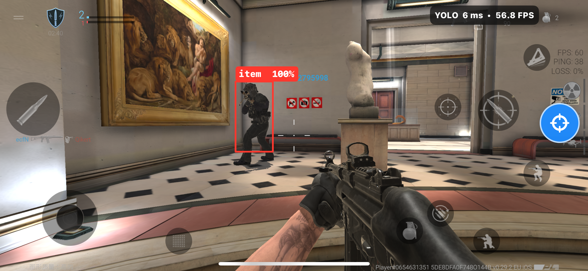
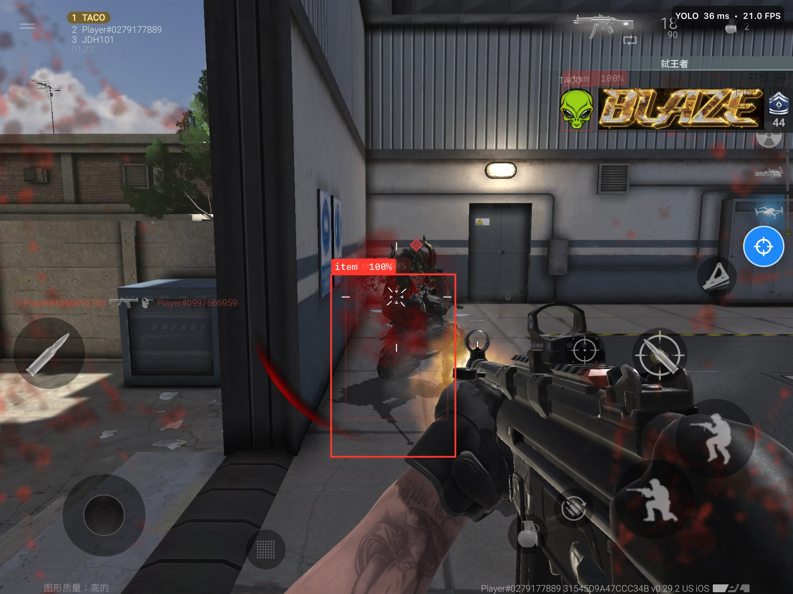

# iOS-Yolo-Aim · YoloTweak

基于 Apple CoreML 的实时 YOLO 目标检测 iOS 框架。
An iOS framework for real-time YOLO object detection powered by Apple CoreML.

---

## 简介 / Introduction

YoloTweak 是一个 iOS 动态框架，集成 YOLO 模型与 CoreML 推理引擎，通过屏幕捕获实现实时目标检测。利用 Apple Neural Engine 加速，推理延迟低至 6ms。

YoloTweak is an iOS dynamic framework integrating YOLO with CoreML for real-time screen-based detection. Powered by the Apple Neural Engine, inference latency is as low as 6ms.

---

## 实战图片 / Demo





---

## 项目结构 / Structure

```
YoloTweak/
├── YoloTweak.h
├── YTOverlayManager.h/.m    # 检测结果叠加层渲染
├── YTScreenDetector.h/.m    # 屏幕捕获与推理
├── best.mlmodelc/           # 编译后的 CoreML 模型
├── best.pt                  # PyTorch 原始权重
└── YoloTweakTests/
```

---

## 构建 / Build

| 项 / Item | 值 / Value |
|---|---|
| Bundle ID | `com.dzyolo.dz.YoloTweak` |
| iOS Target | 17.2 |
| 语言 / Language | Objective-C + Swift |
| Xcode | 15.2 |

```bash
git clone git@github.com:YOUTH8908/iOS-Yolo-Aim.git
xcodebuild -scheme YoloTweak -configuration Release -sdk iphoneos build
```

---

<div align="center">

Author: [YOUTH8908](https://github.com/YOUTH8908)

</div>
